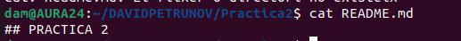
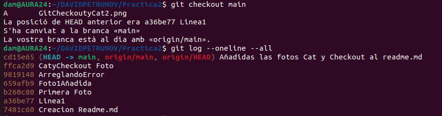

## PRACTICA 2 

Para empezar comprobamos la cantidad de commit que tenemos;

Ahora realizamos un cat para ver lo que hay en el Readme.md del commit mas reciente (Mas reciente en el momento de la foto);

Ahora que hemos visto lo de la version mas reciente podemos hacer un checkout para ir a un commit mas antiguo y luego otro cat para ver los cambios que ha habido desde el commit antiguo al nuevo

(Me olvide de hacer la foto del head cambiado por eso hay mas commits en esta)

Aqui tenemos un checkout y cat de otro commit

(Me olvide de hacer la foto del head cambiado por eso hay mas commits en esta)

Finalizamos el git checkout volviendo al main 

